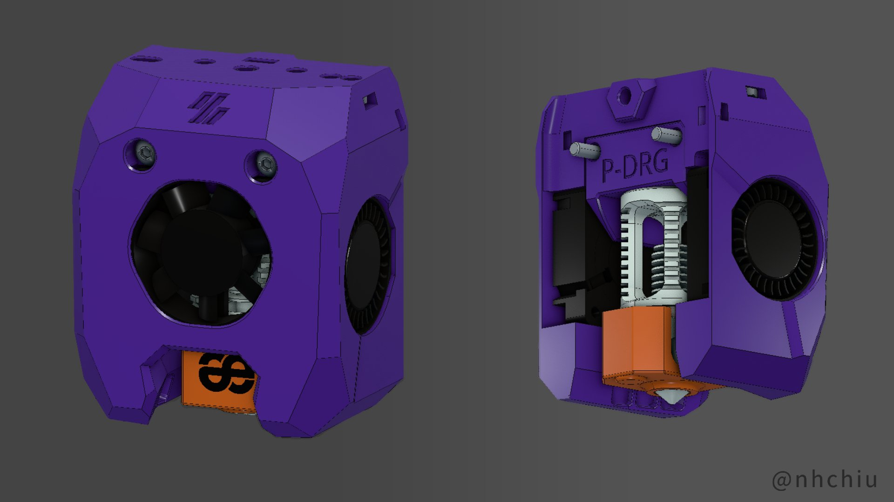
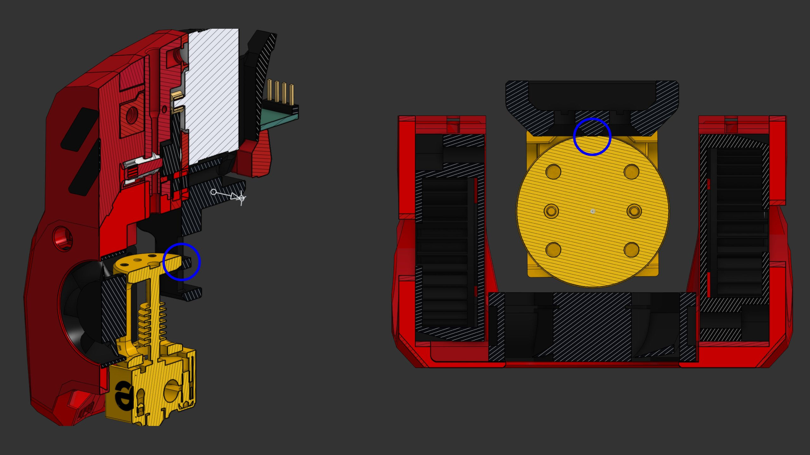
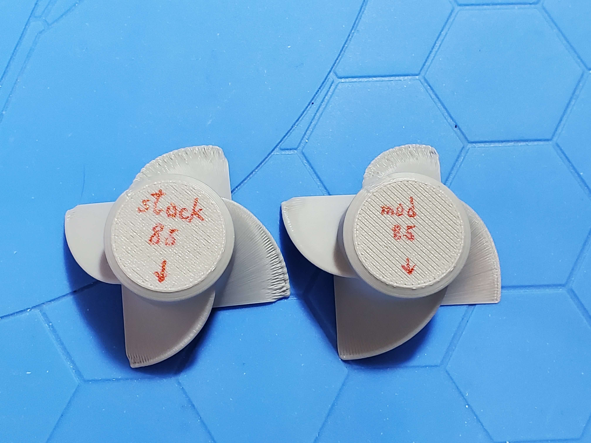
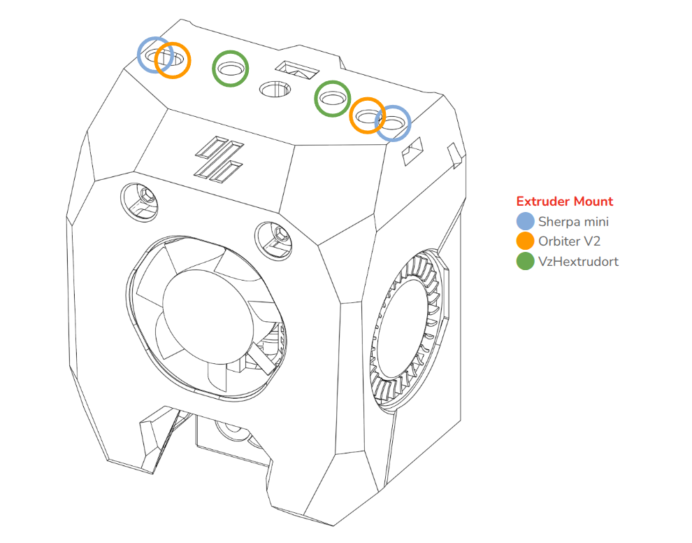
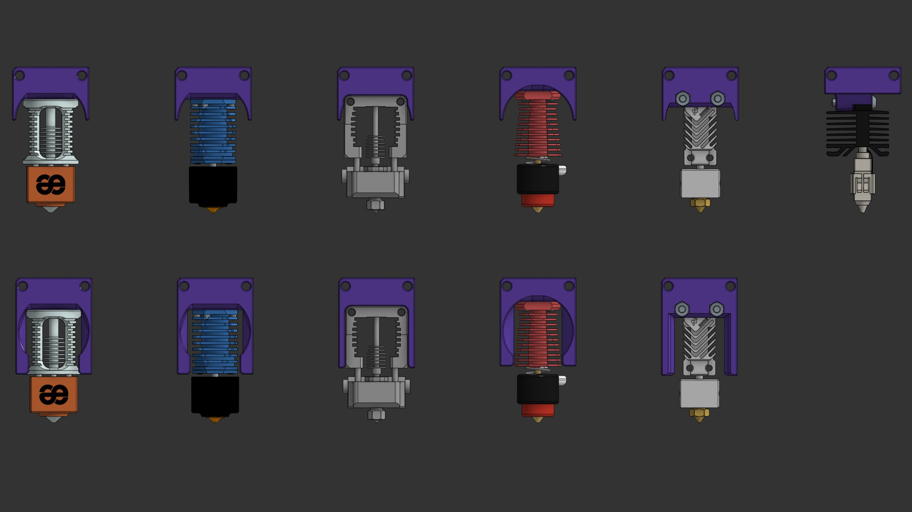
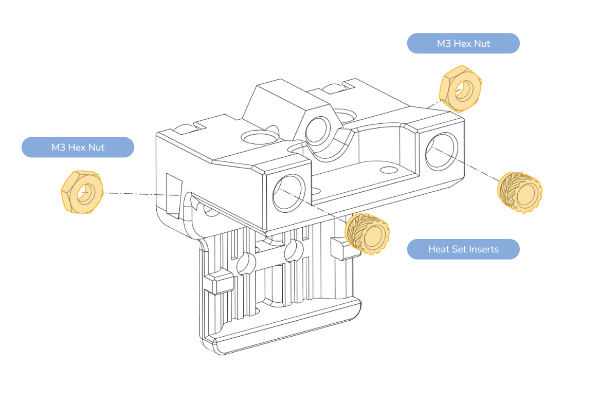
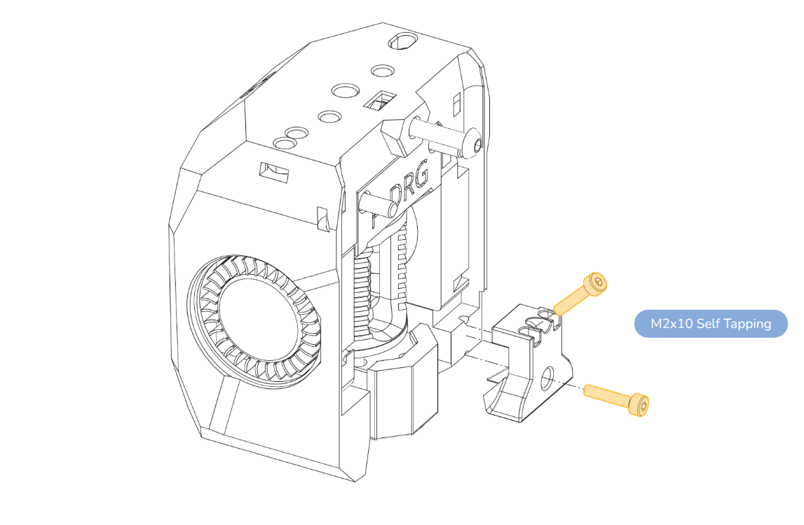
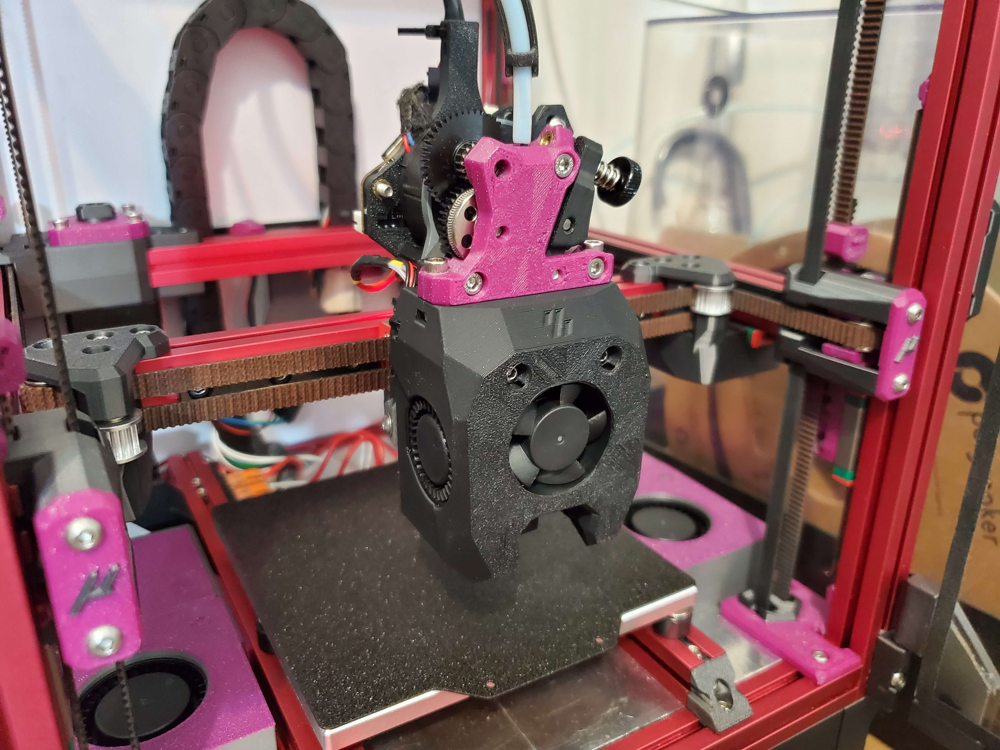

# MiniSB Draco

Yet another versatile toolhead design for Voron 0.2.

MiniSB Draco (for Dragon) is designed primarily to fix the miniSB's compatibility with the Phaetus Dragon hotend.

If you would like to support my work, the following platforms are available. Thank you!

> [!NOTE]
> \* Aliexpress links are *affiliate links*. If you purchase products through these links, I may earn a small commission at no additional cost to you.
> This helps support the development and maintenance of my projects. Thank you for your support!

## Features

- Interference occurs between 22 mm-diameter hotends and the X carriage on the miniSB. This toolhead was redesigned from scratch to avoid that. (NOTE: The print area is shifted 0.4 mm toward the front, so you may lose a bit of print area on V0. A slimmer X carriage is provided to compensate.)
  
- Supports most common extruders; inspired by [Omniburner](https://www.printables.com/model/854317-omniburner-universial-mini-stealthburner-for-most).
- Supports the [Klicky probe](https://github.com/jlas1/Klicky-Probe/tree/main/Printers/Voron/v0) or [ZeroClick](https://github.com/zruncho3d/ZeroClick).
- Redesigned part-cooling fan duct; it may provide slightly better part-cooling performance. (Left side is the stock miniSB.)
  

## BOM

- 3010 blower fans for part cooling x 2
- 3010 axial fan for hotend cooling
- Fasteners:
  - **M3 hex nuts** x 3 (2 for Sherpa mini / Orbiter V2 mount, 1 for X carriage mount)
  - **M3x8mm BHCS** x 2 (VzHextrudort / LGX Light)
  - **M3x35mm BHCS** x 2 (X carriage mount)
  - **M3x20mm BHCS** x 1 (X carriage mount)
  - Fasteners for your hotend

## Supported Hardware

Choose a supported extruder and hotend listed below and print the corresponding STL files.

### Extruder

There are 3 main types of supported extruders:

| Extruder                                                                 | Alternatives                                                                                                                                                                                                                                    |
| ------------------------------------------------------------------------ | ----------------------------------------------------------------------------------------------------------------------------------------------------------------------------------------------------------------------------------------------- |
| [Sherpa Mini](https://github.com/Annex-Engineering/Sherpa_Mini-Extruder) | [ProtoXtruder](https://www.printables.com/model/436425-protoxtruder) / [ProtoXtruder 2.0](https://www.printables.com/model/822947-protoxtruder-20) / [StealthProtoXtruder 2.0](https://www.printables.com/model/1372682-stealthprotoxtruder-20) |
| [Orbiter V2.0](https://orbiterprojects.com/orbiter-v2-0/)                | [Orbiter V2.5](https://www.orbiterprojects.com/orbiter-v2-5/) / [Galileo 2 (G2SA)](https://github.com/JaredC01/Galileo2)                                                                                                                        |
| [Vz-Hextrudort](https://github.com/VzBoT3D/Vz-HextrudORT)                | [LGX Lite](https://www.bondtech.se/product/lgx-lite-large-gears-extruder/) / [Hummingbird](https://www.printables.com/model/367706-hummingbird-extruder)                                                                                        |

### Hotend

| Hotend                                                                                      | Alternatives                                                                                        | Fasteners                                                     |
| ------------------------------------------------------------------------------------------- | --------------------------------------------------------------------------------------------------- | ------------------------------------------------------------- |
| [Phaetus Dragon](https://www.phaetus.com/products/dragon-hotend-st)                         | [TZ-V6-2.0 \*](https://s.click.aliexpress.com/e/_c4XmgSCF)                                          | **M2.5x8mm BHCS/SHCS** x 4                                    |
| [Phaetus Dragonfly BMO](https://www.phaetus.com/products/dragonfly-hotend-bmo)              |                                                                                                     | **M2.5x8mm BHCS/SHCS** x 4                                    |
| [Slice Engineering Mosquito](https://www.sliceengineering.com/products/the-mosquito-hotend) | [Mellow NF-Crazy SF](https://3dmellow.com/products/nf-crazy-v1-hotend)                              | **M2.5x8mm BHCS/SHCS** x 2                                    |
| [E3D Revo Voron](https://e3d-online.com/products/revo-voron-coldside-kits)                  |                                                                                                     | **M3x8mm BHCS** x 4                                           |
| [Mellow NF-Zone-V6 \*](https://s.click.aliexpress.com/e/_c4D5KePZ)                          |                                                                                                     | **M3x16mm BHCS** x 2, M3 Hex nuts x 2                         |
| [Bambu Hotend - X1C](https://asia.store.bambulab.com/products/bambu-hotend-x1c)             | [Phaetus Conch Hotend - X1/P1](https://www.phaetus.com/products/conch-hotend%E2%84%A2-x1-p1-series) | **M3x16mm BHCS** x 2, Heat set inserts (**M3 x D5 x H4**) x 2 |

## Print Settings

Use at least 3 perimeters and 40% infill. ABS or ASA are recommended.

All STL files are oriented for printing. No supports required.

## Assembly

1. Prep for X carriage.

   
2. Screw the reinforcement screws into the plastic. (Optional)

   
3. If you are using ZeroClick or the Klicky probe, follow their instructions to prepare the probe mount.

   
4. Mount the toolhead to the X carriage.

   

## Changelog

### 2026-01-24

- Initial release

## Photo

## Credits

- The stock toolhead design: [miniStealthBurner](https://github.com/VoronDesign/Voron-0/tree/Voron0.2r1/STLs/Toolheads/Mini_Stealthburner).
- [Omniburner](https://www.printables.com/model/854317-omniburner-universial-mini-stealthburner-for-most).
