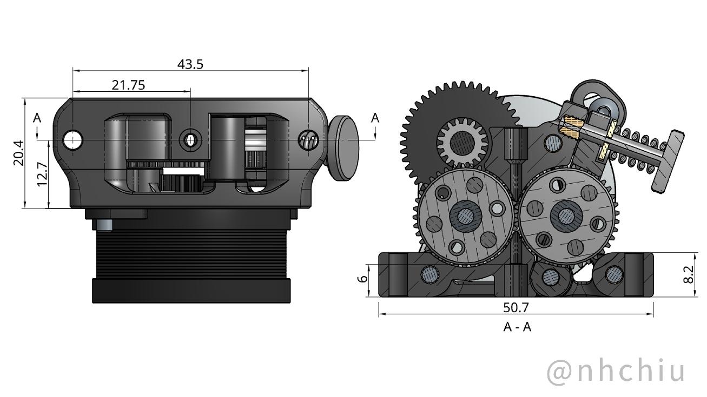
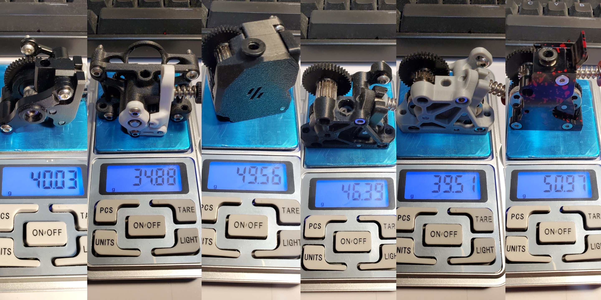
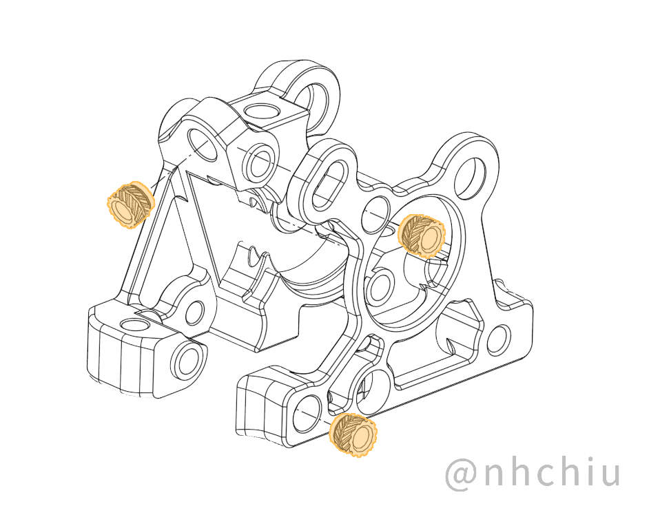
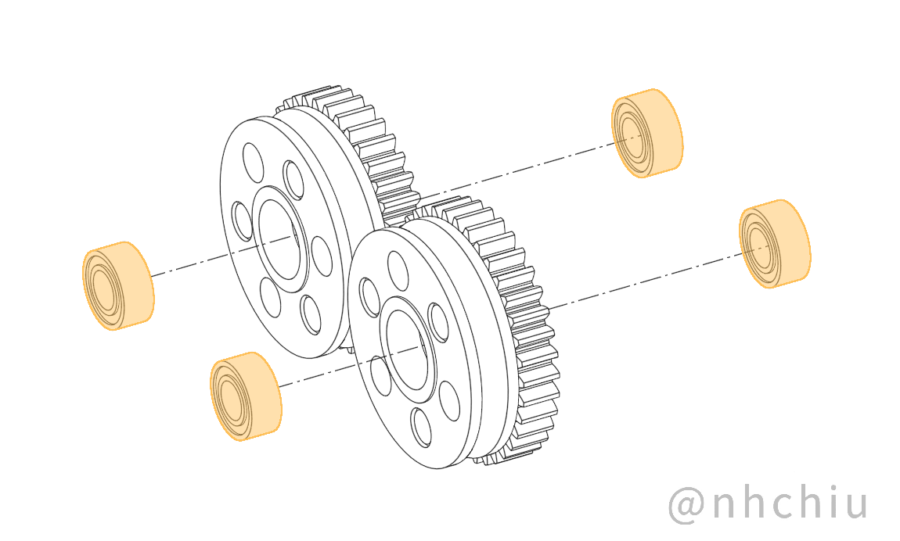
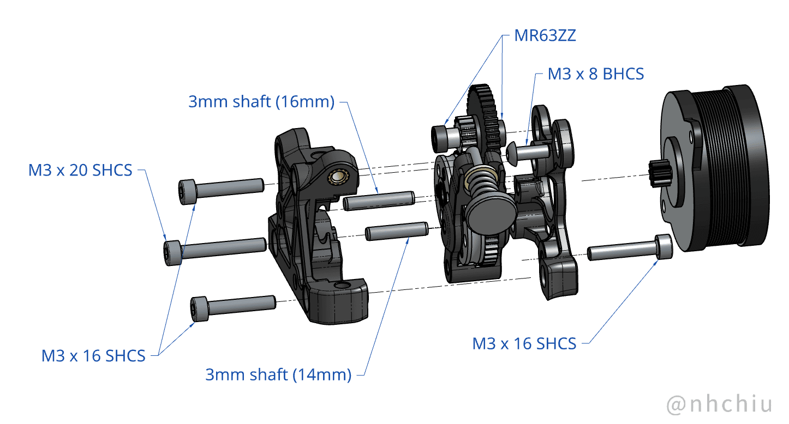
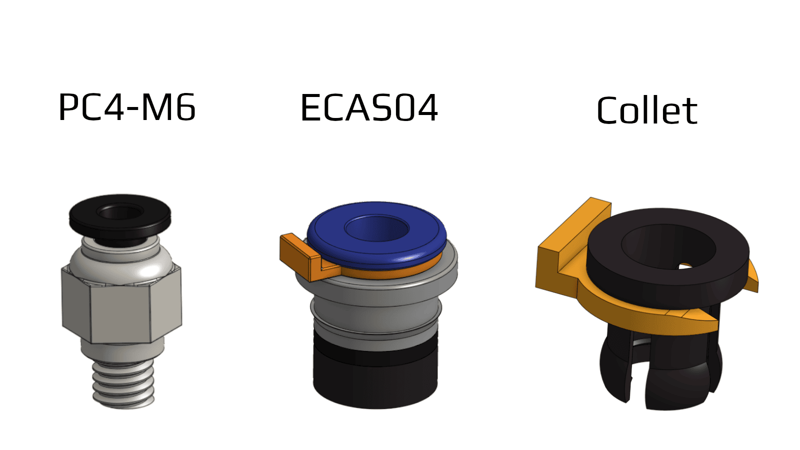

# ProtoXtruder 2.0


The sequel of [ProtoXtruder](https://www.printables.com/model/436425-protoxtruder)!
With the new gears of [HGX 2.0 Extruder](https://www.aliexpress.com/item/1005005911670091.html),
it becomes thinner and lighter while providing the same benefits of the large-sized gears.

Although it is named ProtoXtruder **2.0**, it's not a direct upgrade from the previous design.
There's not much you can reuse in the BOM.

Refer to the dimensions in the drawing below for compatibility with your printer.
The mounting holes are compatible with [Sherpa Mini Extruder](https://github.com/Annex-Engineering/Sherpa_Mini-Extruder).



If you would like to support my work, the following platforms are available. Thank you!

[](https://ko-fi.com/H2H4FT4J7)
[](https://paypal.me/2nhchiu)

## Features

- High gear reduction ratio (44:10, 37:17).
- Large extrusion gears (18mm diameter) providing large filament contact area.
- Twirling hobbed teeth for nice filament grip and consistent flow.\*
- Compact and light weight. All the printed parts can be printed in about 1hr.
- Variants for different Bowden tube retainers.
- Low profile and low center of mass.

  > \[\*\]: The effect of the oblique/twirling teeth still needs more testing.
  >
  > Here are the pros and cons from my own experience with and what I heard about [Vz-HextrudORT](https://github.com/VzBoT3D/Vz-HextrudORT):
  >
  > Pros:
  >
  > - It requires very little tension to provide a very good grip on the filament.
  > - The inclined tooth profile cause less deviation on the flow rate when it leaves tooth marks on the filament.
  >
  > Cons:
  >
  > - It creates a twisting force on the filament when there is higher back pressure in the hotend.
  >   It might cause issues when printing flexible materials or at high flow rate.
  >
  > I haven't seen issues with the HGX 2.0 gears so far but your millage may vary.
  >

## Weight Comparison

Just as a rough reference. They are not printed in the exact same material and printing profile.

The CNC Vz-Hextrudort I got is from the early batches.
They added more cutouts in later versions so the newer ones should be lighter.

From left to right:

|  Extruder  | CNC<br />VzHextrudort | Sherpa mini | Hummingbird | ProtoXtruder | ProtoXtruder 2.0 | HGX 2.0 |
| :--------: | :-------------------: | :---------: | :---------: | :----------: | :--------------: | :-----: |
| Weight (g) |         40.0         |    34.9    |    49.6    |     46.4     |       39.5       |  51.0  |



## BOM

- Oblique Tooth HGX 2.0 Extruder Gear Kit ([AliExpress](https://www.aliexpress.com/item/1005005911670091.html)). (I am not very sure what's included in the gear kit. I'll update here as I get confirmation or feedbacks.)
  - MR63ZZ bearings x 6
  - 3mm shaft (16mm length) x 1
  - 3mm shaft (14mm length) x 1
  - Large extrusion gear (with oblique teeth) x 2
  - Reduction gear x 1
- Fasteners:
  - M3x8mm BHCS x 1
  - M3x16mm SHCS x 3
  - M3x20mm SHCS x 1
  - Heat set inserts (**Voron size - M3 x D5 x H4**) x 3
- NEMA14 36mm round pancake motor with 10T gear (8T should be compatible)

## Print Settings

At least 3 perimeters, 40% infill. ABS or ASA recommended.

All STL files are oriented in the printing orientation. No support required.

It will need *some* bridging.

## Assembly

1. Install M3 heat-set inserts.

   
2. Insert the MR63 bearings into the extrusion gears. (Two for each gear)

   
3. Now the extruder can be put together with the fasteners.

   **Note that the M3x16 SHCS going in from the motor side is threading into plastic, and it shouldn't be tightened. Only turn it until the screwhead is flush with the printed part.**

   
4. (Optional) Add the Bowden tube retainer of your choice.

   **Remove the bottom half of the ECAS04. (the black parts in plastic/rubber)**

   

## Firmware Settings

For [klipper firmware](https://www.klipper3d.org/):

```ini
[extruder]
rotation_distance: 53.494165  # Re-calibrate your own value
gear_ratio: 44:10, 37:17
```

**You might need to invert the `dir_pin` of the extruder.**

## Changelog

### 2024-03-28

- Initial release

## Special Thanks

Designing and testing an extruder design takes a lot of time and many iterations.

Thanks to [Polymaker](https://polymaker.com/) for sponsoring me the filament for printing many prototypes.

Also, thanks to Haldis / HS3DPrinter for sending me a HGX 2.0 extruder for me to make
designs with their new gears.
Their products are available on [their website](https://hs3dprinter.com/) and [AliExpress](https://haldis3d.aliexpress.com/store/910334039).

## Photo


## Credits

- The design is inspired by [Sherpa Mini Extruder](https://github.com/Annex-Engineering/Sherpa_Mini-Extruder) from [Annex Engineering](https://github.com/Annex-Engineering)
