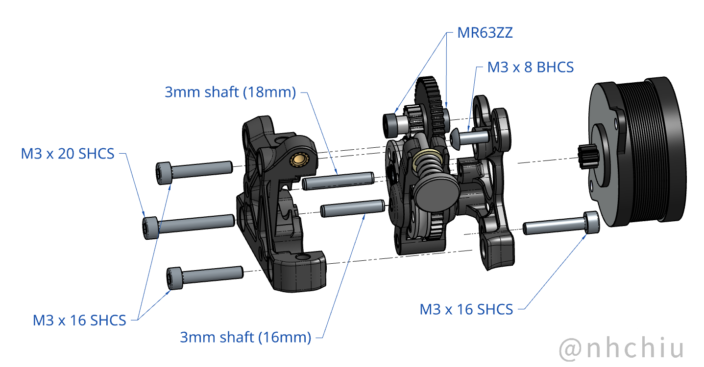
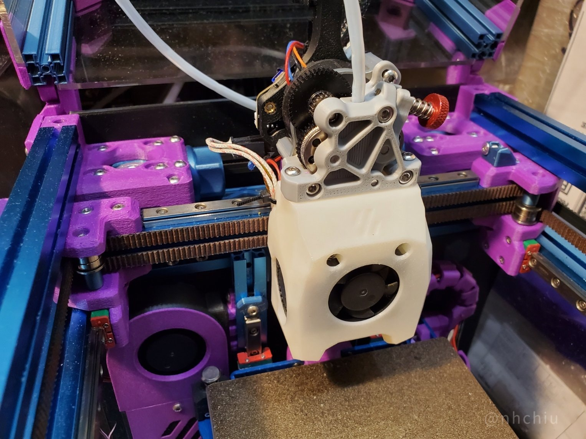

# ProtoXtruder 2.0


This is the successor to [ProtoXtruder](https://www.printables.com/model/436425-protoxtruder).
With the new gears from the [HGX 2.0 Extruder](https://s.click.aliexpress.com/e/_Dmy9Crl) **(affiliate link)**,
the design becomes thinner and lighter while preserving the benefits of the larger gears.

Although it is named ProtoXtruder **2.0**, it's not a direct upgrade from the previous design.
There isn't much you can reuse in the BOM.

Refer to the drawing below for dimensions and compatibility with your printer.
The mounting holes are compatible with the [Sherpa Mini Extruder](https://github.com/Annex-Engineering/Sherpa_Mini-Extruder).


If you'd like to support my work, the following platforms are available. Thank you!

[](https://ko-fi.com/H2H4FT4J7)
[](https://paypal.me/2nhchiu)

> This page contains affiliate links. If you purchase products through these links, I may earn a small commission at no additional cost to you.
> This helps support the development and maintenance of my projects. Thank you for your support!

## Features

- High gear reduction ratios (44:10, 37:17).
- Large extrusion gears (18 mm diameter) providing a large filament contact area.
- Oblique/twirling hobbed teeth for improved filament grip and consistent flow.*
- Compact and lightweight. All printed parts can be produced in about one hour.
- Variants for different Bowden tube retainers.
- Low profile and low center of mass.
- Optional support for a toolhead filament sensor.

> [!NOTE]
> *: The effect of the oblique/twirling teeth still needs further testing.
>
> Below are pros and cons based on my experience and feedback regarding the [Vz-HextrudORT](https://github.com/VzBoT3D/Vz-HextrudORT):
>
> Pros:
>
> - It requires very little tension to provide a very good grip on the filament.
> - The inclined tooth profile causes less deviation in flow rate when it leaves tooth marks on the filament.
>
> Cons:
>
> - It introduces a twisting force on the filament under higher back pressure from the hotend.
>   This may cause issues when printing flexible materials or at high flow rates.
>
> I haven't observed issues with the HGX 2.0 gears so far, but your mileage may vary.

## Weight Comparison

This is a rough reference; the parts were not printed in identical materials or with identical print profiles.

The CNC Vz-HextrudORT I received is from early batches.
Later versions added more cutouts, so newer ones are likely lighter.

From left to right:

|  Extruder  | CNC<br />VzHextrudort | Sherpa mini | Hummingbird | ProtoXtruder | ProtoXtruder 2.0 | HGX 2.0 |
| :--------: | :-------------------: | :---------: | :---------: | :----------: | :--------------: | :-----: |
| Weight (g) |         40.0          |    34.9     |    49.6     |     46.4     |       39.5       |  51.0   |


## BOM

- Oblique Tooth HGX 2.0 Extruder Gear Kit ([this](https://s.click.aliexpress.com/e/_Dmy9Crl) or [this](https://s.click.aliexpress.com/e/_Dn3gb6n)) **(both are affiliate links)**. (I'm not certain what's included in the gear kit; I'll update this as I receive confirmation or feedback.)
  - MR63ZZ bearings × 6
  - 3 mm shaft (18 mm length) × 1 (16–18 mm may work)
  - 3 mm shaft (16 mm length) × 1 (14–16 mm may work)
  - Large extrusion gear (with oblique teeth) × 2
  - Reduction gear × 1
  - Thumb screw and tensioner spring
- Fasteners:
  - M3 × 8 mm BHCS × 1
  - M3 × 16 mm SHCS × 3
  - M3 × 20 mm SHCS × 1
  - Heat-set inserts (Voron size — M3 × D5 × H4) × 3
- NEMA14 36 mm round pancake motor with 10T gear (8T should be compatible)

## Print Settings

Use at least 3 perimeters and 40% infill. ABS or ASA recommended.

All STL files are oriented for printing; no supports required.

It will need *some* bridging.

## Assembly

1. Install M3 heat-set inserts.

   

2. Insert the MR63 bearings into the extrusion gears (two per gear).

   

3. Assemble the extruder using the fasteners.

   **Note: the M3 × 16 SHCS inserted from the motor side threads into plastic - do not overtighten.**
   **Tighten only until the screw head is flush with the printed part.**

   

4. (Optional) Add the Bowden tube retainer of your choice.

   **Remove the bottom half of the ECAS04 (the black plastic/rubber parts).**

   

## Toolhead Filament Sensor

Use in conjunction with this **Toolhead Filament Sensor for ProtoXtruder 2.0**

<iframe src="https://www.printables.com/embed/1589915" width="400" height="445" scrolling="no" frameborder="0"></iframe>

## Firmware Settings

For [Klipper firmware](https://www.klipper3d.org/):

```ini
[extruder]
rotation_distance: 53.494165  # Re-calibrate your own value
gear_ratio: 44:10, 37:17
```

**You might need to invert the `dir_pin` of the extruder.**

## Changelog

### 2026-02-08

- Add support for toolhead filament sensor

### 2024-04-19

- Update to match the pin length of the gear kit.

### 2024-03-28

- Initial release

## Special Thanks

Designing and testing an extruder takes a lot of time and many iterations.

Thanks to [Polymaker](https://polymaker.com/) for sponsoring the filament used to print many prototypes.

Also thanks to Haldis / HS3DPrinter for sending me an HGX 2.0 extruder so I could design with their new gears.
Their products are available on [their website](https://hs3dprinter.com/) and [AliExpress](https://s.click.aliexpress.com/e/_DchaZFt) **(affiliate link)**.

## Photo



## Credits

- The design is inspired by [Sherpa Mini Extruder](https://github.com/Annex-Engineering/Sherpa_Mini-Extruder) from [Annex Engineering](https://github.com/Annex-Engineering)
